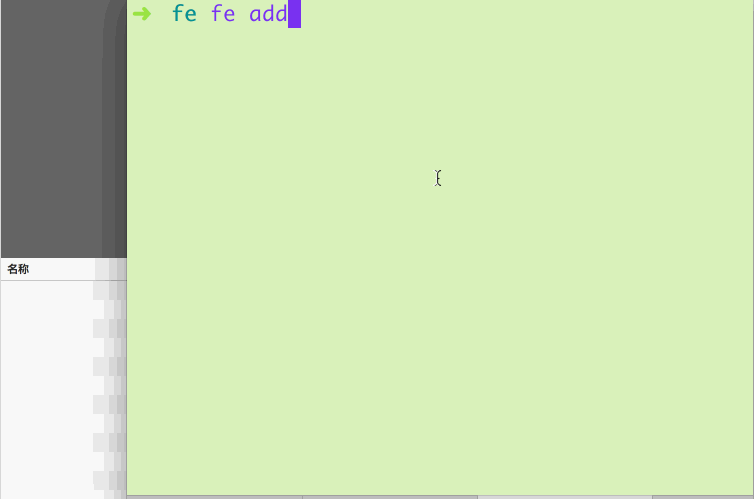
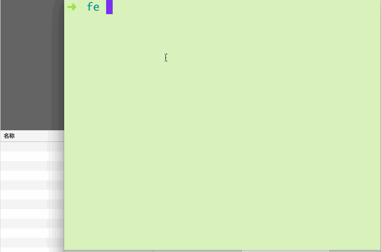

# fecli

> 一键下载 github 仓库作为模板


## 使用

```
$ fe add
$ fe init
$ fe list
$ fe delete
```

## 命令的功能

### fe add

> 全局添加 github 模板

需要注意的是添加模板信息的时候尽量使用 **英文** ，中文在显示列表的时候会引起表格错乱。



### fe list

> 显示模板列表



### fe init

> 初始化某一个模板


### fe delete

> 删除已添加模板


